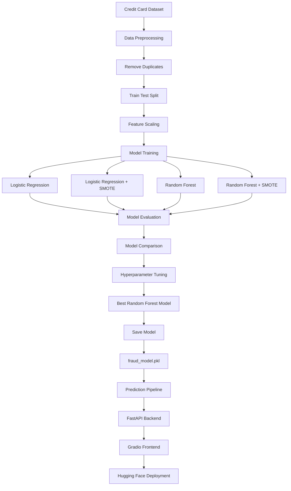
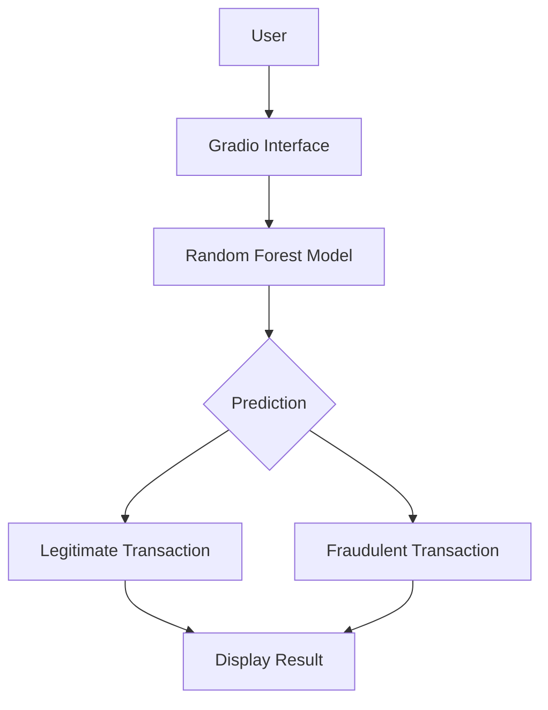

#  Fraud Detection System

An end-to-end Machine Learning project for detecting fraudulent credit card transactions using Logistic Regression, Random Forest, SMOTE, and Hyperparameter Tuning. The final model is deployed using Gradio on Hugging Face Spaces.

---

##  Live Demo

 https://blvvck-fraud-detection.hf.space

---

##  Project Flow



---

##  Dataset

**Credit Card Fraud Detection Dataset**

- 226,602 Legitimate Transactions
- 378 Fraudulent Transactions
- Highly Imbalanced Dataset
- Binary Classification Problem

### Target Variable

| Class | Description |
|---------|-------------|
| 0 | Legitimate Transaction |
| 1 | Fraudulent Transaction |

---

##  Data Preprocessing

The following preprocessing steps were performed:

- Removed duplicate records
- Train-Test Split (80:20)
- Feature Scaling using StandardScaler
- Class balancing using SMOTE

---

##  Models Evaluated

| Model | Precision | Recall | F1 Score |
|---------|---------:|---------:|---------:|
| Logistic Regression | 0.8462 | 0.5789 | 0.6875 |
| Logistic Regression + SMOTE | 0.0530 | 0.8737 | 0.1000 |
| Random Forest | 0.9718 | 0.7263 | 0.8313 |
| Random Forest + SMOTE | 0.8987 | 0.7474 | 0.8161 |

---

##  Best Model

### Random Forest Classifier

Performance:

| Metric | Score |
|----------|----------|
| Accuracy | 99.95% |
| Precision | 97.18% |
| Recall | 72.63% |
| F1 Score | 83.13% |

---

##  Hyperparameter Tuning

Technique Used:

```python
RandomizedSearchCV
```

Best Parameters:

```python
{
    "n_estimators": 200,
    "max_depth": None,
    "min_samples_split": 2,
    "min_samples_leaf": 1
}
```

Best Cross Validation Score:

```text
0.8344
```

---

##  Deployment Architecture


## Project Structure

```text
Fraud Detection/
│
├── app.py
├── requirements.txt
├── README.md
│
├── app/
│   ├── main.py
│   └── gradio_app.py
│
├── src/
│   ├── preprocessing.py
│   ├── train.py
│   ├── train_smote.py
│   ├── train_random_forest.py
│   ├── train_random_forest_smote.py
│   ├── tune_random_forest.py
│   ├── save_model.py
│   └── predict.py
│
└── reports/
    └── model_comparison.csv
```


## Author

**Dhruv**

